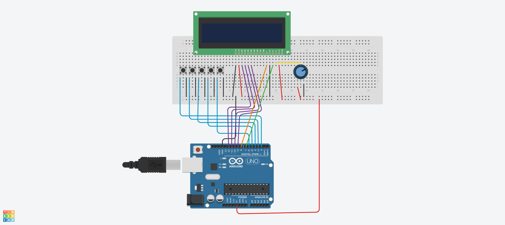
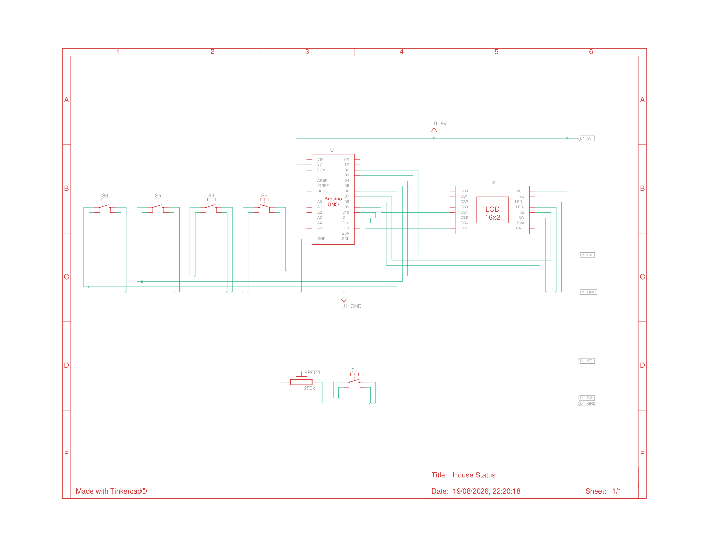

# House Status LCD

An Arduino project using a 16x2 LCD and 5 push buttons to let tenants in a shared house toggle their in/out status for others to see at a glance.

## Overview

Uses the LCD with 5 buttons to toggle a list of tenants at a uni house so others can see if they are in. Buttons act as toggles — press once to mark someone "home", press again to mark them "out".

## Circuit Diagram

## Wiring

**LCD**
| LCD Pin | Arduino Pin |
|---|---|
| RS | Digital 7 |
| Enable | Digital 8 |
| D4 | Digital 9 |
| D5 | Digital 10 |
| D6 | Digital 11 |
| D7 | Digital 12 |
| R/W | GND |
| VSS | GND |
| VCC | 5V |
| VO | Wiper of 10K potentiometer |

**Buttons**
| Button | Arduino Pin |
|---|---|
| Button 1 | Digital 6 |
| Button 2 | Digital 5 |
| Button 3 | Digital 4 |
| Button 4 | Digital 3 |
| Button 5 | Digital 2 |

## Getting Started

1. Wire up the circuit as described above (see schematic).
2. Open the sketch in the Arduino IDE.
3. Upload to your board.
4. Assign each button to a tenant and press to toggle their status on the LCD.

## License

MIT
